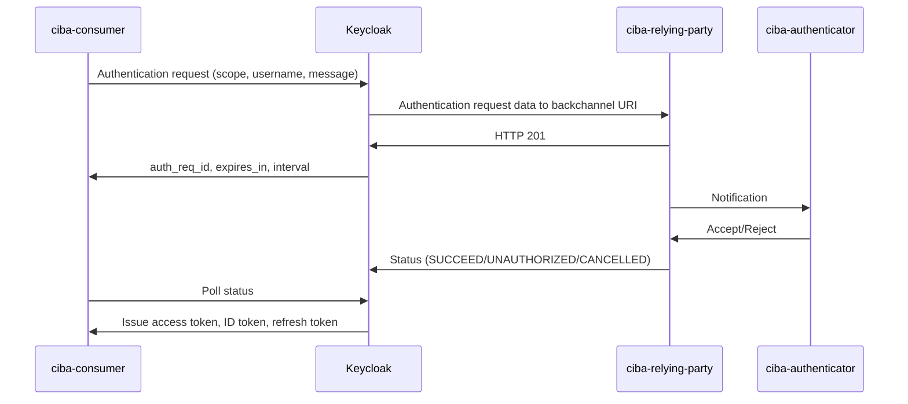

# Client-Initiated Backchannel Authentication with Keycloak

This is a demonstration of CIBA authentication flow with Keycloak as authorization server.



## Requirements

- JDK 21
- Docker
- Docker Compose

## Running

```shell
./gradlew bootJar
docker compose up --build
```

## Usage

Go to http://localhost:8080, sign in using "admin" as username and password.
Then switch to `ciba-demo` realm and create a new user under Users section.

Then open http://localhost:8002/ and http://localhost:8001/ in separate web browser tabs or windows.

Submit a form in http://localhost:8001/, which will trigger new authentication request.
The page will periodically refresh to poll authentication status.

Then, switch to already opened http://localhost:8002/ tab. You will see a new request
appear in the table with 2 buttons - Accept and Reject. Click one of the buttons

Switch back to the polling tab to see the authentication status.
